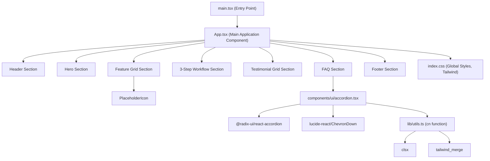

# System Patterns: Magnific Landing Page

## 1. Overall Architecture
- **Frontend Application:** The project is a single-page application (SPA) built with React and TypeScript.
- **Static Site:** Given its nature as a landing page with no complex backend interactions apparent from the `src` code (e.g., user logins, dynamic data fetching from a project-specific API), it functions primarily as a static or mostly static site.
- **Component-Based UI:** The UI is built using reusable React components. It leverages a UI component library (likely shadcn/ui, given the `accordion.tsx` structure and `@/components/ui` path).

## 2. Key Technical Decisions (Inferred)
- **React for UI:** Chosen for its component model and ecosystem.
- **TypeScript for Type Safety:** Used to improve code quality and maintainability.
- **Vite for Build Tooling:** Inferred from `vite-env.d.ts` and the common setup for modern React projects. Vite provides fast development server startup and optimized builds.
- **Tailwind CSS for Styling:** Used for utility-first CSS, enabling rapid UI development and customization. This is evident from `index.css` and the class names in `App.tsx`.
- **shadcn/ui (Likely) for UI Components:** The structure of `components/ui/accordion.tsx` and the use of Radix UI primitives (`@radix-ui/react-accordion`) wrapped in custom components is characteristic of shadcn/ui. The `cn` utility function from `lib/utils.ts` (combining `clsx` and `tailwind-merge`) is also a common pattern with shadcn/ui.

## 3. Design Patterns in Use
- **Component-Based Architecture:** Standard React pattern.
- **Container/Presentational Components (Implicit):** `App.tsx` acts as a container for various presentational sections.
- **Utility-First CSS:** Tailwind CSS methodology.
- **Props for Configuration:** Components like the Accordion and sections in `App.tsx` receive data/content via props.
- **State Management (Minimal):** `useState` is used for simple UI state, like the FAQ accordion's open state in `App.tsx`.

## 4. Component Relationships (High-Level)

## 5. Data Flow
- **Static Content:** Most content (text, image URLs for testimonials, feature labels) is hardcoded within `App.tsx`.
- **Props Down:** Data is passed from `App.tsx` down to child components/sections as props.
- **Local State:** Simple UI interactions (like opening/closing FAQ items) are handled by local component state (`useState` in `App.tsx`).

## 6. Key Dependencies (from imports)
- `react`
- `react-dom/client`
- `@radix-ui/react-accordion` (for the accordion component)
- `lucide-react` (for icons like ChevronDown)
- `clsx` (for conditional class names)
- `tailwind-merge` (for merging Tailwind CSS classes) 